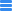

# Icon
----------------

## Usage
系統內所有 **Icon**

---
## Sample Code

### Simple Usage
```
  <icon
    iconType="iconType"
    :size="iconSize"
    >
  </icon>
```

### Icon with Hover style
```
  <icon
    iconType="iconType"
    :size="iconSize"
    enableHover
    >
  </icon>
```
---
## Props

| Prop | required | Type | Default | 說明 |
|---|---|---|---|---|
| iconType | true | One of 下方[可用 Icons](#myIcons) |  - | Icon 樣式
| size | - | Number | 0 | Icon 大小，單位為 px
| enableHover | - | Boolean | false | Icon 是否允許 Hover 樣式<br>對名稱為 'info' 的 Icon 使用enableHover，hover 時 icon 會替換成 'info_hover' Icon
| button | - | Boolean | false | Hover Icon 時 cursor 是否使用 pointer

---
## Emit Events

| Event | Callback $event | 說明 |
|---|---|---|
| click | onclick event | 點擊 Icon 事件 |

---
<a id="myIcons"></a>

## 可用 Icons
* <h3>[General Icons](#generalIcons)</h3>
* <h3>[Tool Control Icons](#toolControlIcons)</h3>
* <h3>[Arrow Icons](#arrowIcons)</h3>
* <h3>[Menu Icons](#menuIcons)</h3>
* <h3>[Header Icons](#headerIcons)</h3>
* <h3>[Notification & Info Icons](#notificationAndInfoIcons)</h3>
* <h3>[Category Tree Icons](#categoryTreeIcons)</h3>
* <h3>[Intent Page Icons](#intentPageIcons)</h3>
* <h3>[Robot Profile Icons](#robotProfileIcons)</h3>
* <h3>[TaskEngineV2 Icons](#taskEngineV2Icons)</h3>
* <h3>[Other Icons](#otherIcons)</h3>


<a id="generalIcons"></a>
### General Icons
| iconType | Icon | hovered iconType | Icon |
| --- | --- | --- | --- |
| check | 
| check_green | 
| checked | <div style="background:black"></div>
| delete |  | delete_hover | 
| edit_pen | 
| edit_blue | 
| edit_white | <div style="background:black"></div>
| edit_thin | 
| setting |  | setting_hover | 
| search | 
| upload | 
| export | 
| trash_can | 

<a id="toolControlIcons"></a>
### Tool Control Icons
| iconType | Icon |  hovered iconType | Icon |
| --- | --- | --- | --- |
| daggle | 
| more |  | more_hover | 
| more_blue | 
| close_expand | 


<a id="arrowIcons"></a>
### Arrow Icons
| iconType | Icon |
| --- | --- |
| red_arrow | 
| year_left | 
| year_right | 
| month_left | 
| month_right | 
| month_right_white | <div style="background:black"></div>

<a id="menuIcons"></a>
### Menu Icons
| iconType | Icon |
| --- | --- |
| menu_expand | <div style="background:black"></div> |
| menu_statistics | 
| menu_ssm | 
| menu_robot | 
| menu_wordbank | 
| menu_te | 
| menu_privilege | 
| menu_dashboard | 
| menu_intent | 

<a id="headerIcons"></a>
### Header Icons 
| iconType | Icon |
| --- | --- |
| header_enterprise | <div style="background:black"></div>
| header_user | <div style="background:black"></div>
| header_dialog | <div style="background:black"></div>
| header_dropdown | <div style="background:black"></div>
| header_dropdown_gray | 
| header_dropdown_white | <div style="background:black"></div>
| robot | <div style="background:black"></div>

<a id="notificationAndInfoIcons"></a>
### Notification & Info Icons
| iconType | Icon | hovered iconType | Icon |
| --- | --- | --- | --- |
| info |  | info_hover | 
| info_success | 
| info_warning | 
| info_warning_gray | 
| info_error | 
| info_close | 

<a id="categoryTreeIcons"></a>
### Category Tree Icons
| iconType | Icon |
| --- | --- |
| category_add | 
| category_close | 
| category_dropdown | 
| category_open | 

<a id="monitorIcons"></a>
### Monitor Icons
| iconType | Icon | hovered iconType | Icon |
| --- | --- | --- | --- |
| detail |  | detail_hover | 
| stop |  | stop_hover | 
| start |  | start_hover | 
| pause |  | pause_hover | 
| list |  | list_hover | 
| monitor |  | monitor_hover | 
| edit_task |  | edit_task_hover | 
| delete_task |  | delete_task_hover | 

<a id="intentPageIcons"></a>
### Intent Page Icons
| iconType | Icon |
| --- | --- | 
| intent |  

<a id="robotProfileIcons"></a>
### Robot Profile Icons
| iconType | Icon |
| --- | --- | 
| profile_question | 
| profile_answer | 

<a id="taskEnginenV2Icons"></a>
### TaskEngineV2 Top Panel Icons
| iconType | Icon |
| --- | --- | 
| save | 
| canlendar | 
| knowledge_base | 

<a id="otherIcons"></a>
### Others
| iconType | Icon |
| --- | --- |
| add | 
| close | 
| drop_down | 
| edit | 
| enterprise_admin | 
| expand | 
| help | 
| normal_acc | 
| white_add | <div style="background:black"></div>